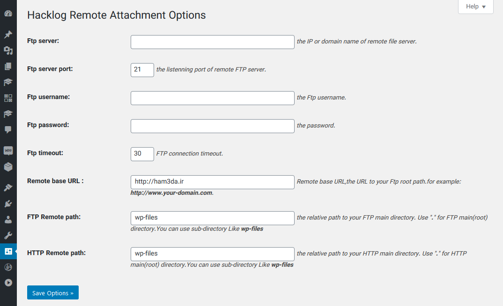

# Hacklog Remote Attachment
Adds remote attachments support for your WordPress blog.

## Description 
Features: Adds remote attachments support for your WordPress blog.

use this plugin, you can upload any files to remote ftp servers(be aware that your FTP server must has Apache or other HTTP server daemon) in WordPress.

* Support both single user site AND multisite.
* support upload files to remote FTP server.
* support delete files on remote FTP server.
* works just like the files are saved on your local server-_-.
* with this plugin,you can move all your local server files to remote server.
* after you've uninstall this plugin,you can move remote server files to local server if you'd like to do so.

## Installation

1. Upload the whole fold `hacklog-remote-attachment` to the `/wp-content/plugins/` directory
2. Activate the plugin through the 'Plugins' menu in WordPress
3. Configure the plugin via `Settings` -> `Hacklog Remote Attachment` menu and it's OK now,you can upload attachments(iamges,videos,audio,etc.) to the remote FTP server.
4. If your have moved all your local server files to remote server,then you can `UPDATE THE DATABASE` so that all your attachments URLs will be OK.

## New changes
* Compatibility with WP 5.3.2
* Plugin Optimization
* Persian Translation

## Screenshots

## 
* Forked from [Hacklog Remote Attachment](https://github.com/wp-plugins/hacklog-remote-attachment/)

## Donation
* <b>Perfect Money:</b> U21873528
* <b>حمایت از ما در ایران:</b> [حمایت ازما](https://ham3da.ir/payment/)
